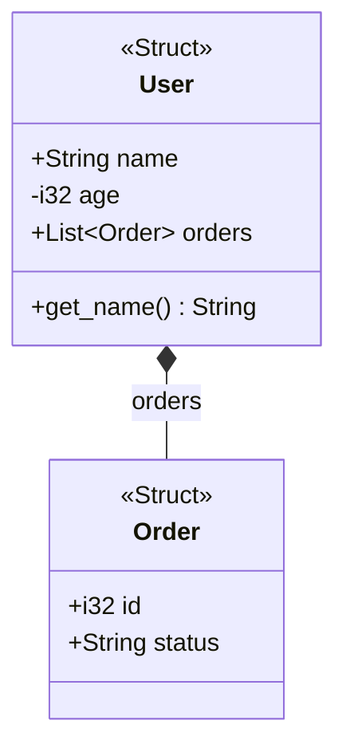
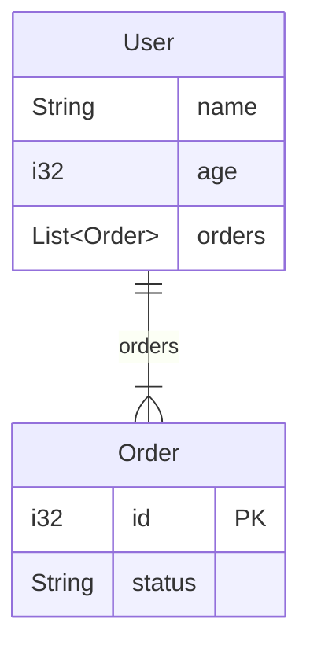

# code-documenter

A CLI tool that reads codebases and generates [Mermaid](https://mermaid.js.org/) diagrams. Supports Rust, Go, and TypeScript.

## Features

- **Three diagram types**: class diagrams, ER diagrams, ZenUML sequence diagrams
- **Three languages**: Rust, Go, TypeScript — parsed via [tree-sitter](https://tree-sitter.github.io/) for fast, accurate AST extraction
- **Automatic language detection** from file extensions
- **Single binary** — no runtime dependencies on language toolchains

### What gets extracted

| Construct | Rust | Go | TypeScript |
|---|---|---|---|
| Structs / Classes | `struct` | `type T struct` | `class` |
| Enums | `enum` | — | `enum` |
| Interfaces / Traits | `trait` | `interface` | `interface` |
| Type aliases | `type` | — | `type` |
| Methods | `impl` blocks | receiver functions | class methods |
| Functions | `fn` | `func` | `function` |
| Inheritance | — | embedded structs | `extends` |
| Implementation | `impl Trait for T` | — | `implements` |
| Visibility | `pub` / private | capitalization | `public` / `private` / `protected` |

### Relationship inference

Field types are analyzed to infer relationships with cardinality:

| Source pattern | Relationship | Cardinality |
|---|---|---|
| `field: User` | Composition | Exactly one |
| `field: Option<User>` / `user?: User` / `*User` | Composition/Aggregation | Zero or one |
| `field: Vec<User>` / `[]User` / `User[]` | Composition | One or more / Zero or more |
| `field: &User` / `Arc<User>` | Aggregation | One |

## Installation

Requires a Rust toolchain (1.70+) and a C compiler (for tree-sitter grammar compilation).

```bash
cargo install --path .
```

Or build from source:

```bash
cargo build --release
./target/release/code-documenter --help
```

## Usage

```
code-documenter [OPTIONS] <PATH>

Arguments:
  <PATH>  Path to source file or directory to analyze

Options:
  -d, --diagram <DIAGRAM>    Diagram type: class, er, zenuml  [default: class]
  -l, --language <LANGUAGE>  Force language: rust, go, type-script  [default: auto]
  -e, --entry <ENTRY>        Entry function for ZenUML sequence diagrams
  -o, --output <OUTPUT>      Output file (defaults to stdout)
```

### Examples

Generate a class diagram from a Rust project:

```bash
code-documenter ./src -d class
```

Generate an ER diagram from a single file:

```bash
code-documenter ./src/model.rs -d er
```

Generate a ZenUML sequence diagram:

```bash
code-documenter ./src -d zenuml
```

Write output to a file:

```bash
code-documenter ./src -d class -o diagram.mmd
```

Force a specific language:

```bash
code-documenter ./lib -d class -l type-script
```

### Sample output

Running `code-documenter` on a Rust file with a few structs produces:



ER diagram output:



## Architecture

```
src/
  main.rs              CLI entry point (clap)
  lib.rs               Orchestration: walk files -> parse -> merge -> emit
  model.rs             Internal IR (CodeModel, Entity, Function, Relationship)
  parse/
    mod.rs             Language detection and parser dispatch
    rust.rs            tree-sitter-rust parser
    go.rs              tree-sitter-go parser
    typescript.rs      tree-sitter-typescript parser
  emit/
    mod.rs             Diagram type dispatch
    class_diagram.rs   Mermaid classDiagram renderer
    er_diagram.rs      Mermaid erDiagram renderer
    zenuml.rs          Mermaid zenuml renderer
```

The pipeline is: **source files -> tree-sitter AST -> CodeModel IR -> Mermaid string**.

Each language parser produces a `CodeModel` containing entities (structs, classes, interfaces), functions, and relationships. Multiple files are parsed independently and merged. The emitter then renders the merged model into the requested Mermaid diagram format.

## Limitations

- **Call graph resolution** (ZenUML) is syntactic, not semantic — function calls are matched by name, not by full qualification. Cross-module calls may not resolve correctly.
- **Generics** are captured structurally but complex generic bounds or where clauses are simplified.
- **Go interfaces** — implicit interface satisfaction is not detected; only explicit embedding is tracked.
- **TypeScript** — decorators, namespaces, and complex mapped/conditional types are not parsed.

## License

MIT
